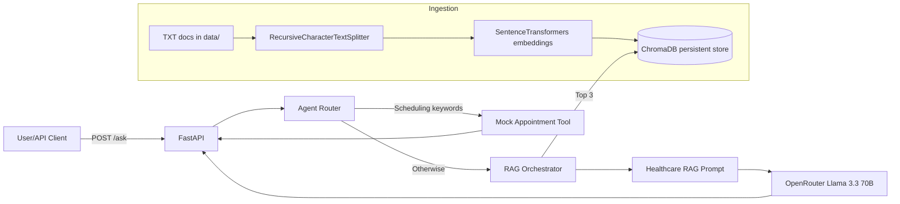

# HealthAI — Healthcare AI Assistant (RAG + OpenRouter)

[](https://github.com/PapputheDev/RAGHealthAI/actions/workflows/ci.yml)

A compact, interview-ready Healthcare AI Assistant demonstrating:

- Synthetic healthcare knowledge base ingestion (TXT/PDF → chunks → embeddings)
- Persistent local vector search using ChromaDB
- Retrieval-Augmented Generation (RAG) using OpenRouter (`meta-llama/llama-3.3-70b-instruct`)
- **Token-by-token streaming** answers over Server-Sent Events
- A simple “agent router” that sends scheduling-related questions to a mock appointment tool
- **Calibrated confidence scoring** with a retrieval relevance floor (skips the LLM and abstains on weak matches)
- **Persistent multi-conversation chat history** (SQLite) with a ChatGPT-style sidebar
- **Document management** (upload, list, delete) and optional shared-key API auth
- A **RAG evaluation harness** (Hit@k / MRR / Recall@k, plus optional LLM-judged faithfulness & relevance)
- **109-test pytest suite + GitHub Actions CI**

This repository uses **synthetic healthcare content only** (see `data/`). It is intended for software demonstration and does **not** provide medical advice.

> **What's new in this iteration** — see [Recent Enhancements](#recent-enhancements) for a summary of everything added on top of the original RAG demo.

## Dataset Details

The knowledge base consists of synthetic healthcare documents:

- appointment_policy.txt
- telehealth_policy.txt
- medication_refill_policy.txt
- insurance_faq.txt
- discharge_instructions.txt
- hipaa_guidelines.txt

These documents were manually created for demonstration purposes and do not contain any real patient data, PHI, or confidential healthcare information.

## Project Overview

The goal is to show an end-to-end RAG pipeline with a clean, modular Python codebase:

- **Ingestion**: read `.txt` docs → chunk → embed → store in ChromaDB
- **Retrieval**: embed query → top-k semantic search
- **Generation**: build a strict “context-only” prompt → call OpenRouter Llama → return answer + sources + confidence

## Recent Enhancements

Built on top of the original RAG demo:

| Area | What was added |
|---|---|
| **Retrieval quality** | Fixed the distance→similarity math (squared-L2 → cosine) so confidence is calibrated; added a **relevance floor** that skips the LLM and abstains when the best match is too weak; sources are dropped when the model abstains |
| **Evaluation** | A reproducible **eval harness** with a labeled test set — Hit@k / MRR / Recall@k (no LLM) plus optional LLM-judged faithfulness & relevance, with JSON/Markdown reports |
| **Testing & CI** | **109 pytest cases** (mocked, deterministic) + **GitHub Actions CI** on Python 3.11/3.12 |
| **Chat history** | **Persistent multi-conversation memory** in SQLite with a ChatGPT-style sidebar (list, open, delete, restore-on-reload) |
| **Streaming** | Token-by-token answers over Server-Sent Events |
| **Documents** | Upload (TXT/PDF) + drag-and-drop, list, and delete indexed documents via API and UI |
| **Security** | Optional shared-key API auth (`APP_API_KEY`) gating all non-trivial endpoints |
| **UX** | Rebuilt single-page UI: sidebar layout, suggestion cards, inline-SVG icons, persistent safety disclaimer, numeric confidence display |

## Technology Choices

| Component | Choice | Reason |
|-----------|--------|--------|
| **LLM** | OpenRouter `meta-llama/llama-3.3-70b-instruct` | Free-tier OpenAI-compatible API; strong reasoning for policy Q&A |
| **Embedding model** | `BAAI/bge-small-en-v1.5` (SentenceTransformers) | Fast, small, normalized vectors; state-of-the-art retrieval benchmarks for its size |
| **Vector database** | ChromaDB (persistent) | Zero-infra local setup; survives restarts; good enough for prototype-scale datasets |
| **Text splitter** | LangChain `RecursiveCharacterTextSplitter` | Sentence-boundary-aware; configurable overlap preserves context across chunk edges |
| **Framework** | FastAPI | Async-ready, auto-generates OpenAPI docs, Pydantic validation built-in |

## Architecture

High-level flow:



Key modules:

- `app/config.py` — typed settings via env vars + `.env` loading
- `app/embeddings.py` — SentenceTransformers singleton (`BAAI/bge-small-en-v1.5`)
- `app/vector_store.py` — persistent ChromaDB wrapper (collection `healthcare_docs`)
- `app/ingest.py` — ingestion pipeline (500/100 chunking)
- `app/prompts.py` — strict healthcare RAG prompt (context-only, refusal rules)
- `app/llm.py` — OpenRouter client with retries/timeouts
- `app/rag.py` — retrieve → prompt → generate → return answer/sources/confidence
- `app/agent.py` — routes appointment questions to a mock tool; otherwise to RAG
- `app/main.py` — FastAPI API surface

## Prompt Engineering

The system uses a strict context-only healthcare prompt. The full prompt template is:

```
You are a Healthcare Policy & Information Assistant.

You must follow these rules strictly:

1) Use only the provided CONTEXT to answer.
    - Do NOT use outside knowledge.
    - Do NOT guess or invent details.
    - If the CONTEXT does not contain enough information to answer, reply with exactly:
      I could not find this information in the provided documents.

2) Safety restrictions (refuse these requests):
    - Diagnosis: Do not diagnose or assess the likelihood of a medical condition.
    - Prescriptions: Do not prescribe, recommend specific prescription drugs, or provide dosage instructions.
    - Emergency guidance: If the user describes an emergency, advise them to seek urgent/emergency care.

3) Source-backed answers:
    - Cite sources from the CONTEXT.
    - Use bracketed citations at the end of the relevant sentence.

4) Style:
    - Be concise and professional.

CONTEXT:
{context}

USER QUESTION:
{question}

ANSWER:
```

Key design decisions:
- The model is explicitly forbidden from using outside knowledge, preventing hallucination.
- The exact fallback phrase is hardcoded in both the prompt and `prompts.py` for consistency.
- Diagnosis/prescription refusals protect against unsafe medical advice.
- Inline citations (`[source: filename]`) are enforced, making answers auditable.

## Agent / Tool Workflow

The `agent.py` module implements a lightweight router:

```
User question
    │
    ▼
Does the question contain scheduling keywords?
("appointment", "book", "schedule", "available slot", …)
    │
    ├── YES → appointment_tool(department, modality)
    │          Extracts department (cardiology, dermatology, …) and modality
    │          (video/in_person) from the question text, then returns
    │          synthetic available slots.
    │
    └── NO  → RAG pipeline
               Retrieve top-3 chunks from ChromaDB → build context →
               format prompt → call OpenRouter Llama → return answer +
               sources + confidence
```

The `route` field in every `/ask` response shows which path was taken.

## Sample Questions and Responses

**Policy question (RAG path):**

```bash
curl -X POST http://localhost:8000/ask \
  -H "Content-Type: application/json" \
  -d '{"question": "Can a patient request a medication refill through telehealth?"}'
```

```json
{
  "answer": "Yes, patients can request medication refills through telehealth if the medication is already prescribed and does not require an in-person evaluation. [source: telehealth_policy.txt]",
  "sources": [
    {"document": "telehealth_policy.txt", "chunk": "Medication refill requests may be reviewed during telehealth visits..."},
    {"document": "medication_refill_policy.txt", "chunk": "Refill requests submitted via telehealth are processed within 72 hours..."}
  ],
  "confidence": "high",
  "route": "rag"
}
```

**Scheduling question (appointment tool path):**

```bash
curl -X POST http://localhost:8000/ask \
  -H "Content-Type: application/json" \
  -d '{"question": "Can I book a cardiology appointment via video call?"}'
```

```json
{
  "answer": "Here are the next available appointment slots (synthetic).\n\nAvailable slots:\n- 2026-06-04T09:00 (20 min, video)\n- 2026-06-04T11:00 (20 min, video)\n- 2026-06-04T13:00 (20 min, video)",
  "sources": [],
  "confidence": "high",
  "route": "appointment_tool"
}
```

**Unknown question (no relevant documents):**

```bash
curl -X POST http://localhost:8000/ask \
  -H "Content-Type: application/json" \
  -d '{"question": "What is the hospital cafeteria menu?"}'
```

```json
{
  "answer": "I could not find this information in the provided documents.",
  "sources": [],
  "confidence": "low",
  "route": "rag"
}
```

## Setup

### 1) Python environment

Python 3.11 is recommended.

```bash
python -m venv .venv
```

Activate:

- Windows PowerShell:

```powershell
.\.venv\Scripts\Activate.ps1
```

Install dependencies:

```bash
pip install -r requirements.txt
```

### 2) Environment variables

Copy `.env.example` to `.env` and set values.

```bash
copy .env.example .env
```

## Environment Variables

All configuration is loaded from `.env` via `app/config.py` (Pydantic Settings). No secrets are hardcoded in source code.

### Setup

```bash
copy .env.example .env    # Windows
cp .env.example .env      # Linux/macOS
# then open .env and paste your OPENROUTER_API_KEY
```

### Variables

| Variable | Required | Default | Description |
|----------|----------|---------|-------------|
| `OPENROUTER_API_KEY` | **Yes** | — | OpenRouter API key for LLM calls. Get one free at openrouter.ai |
| `APP_API_KEY` | No | _(unset)_ | If set, the API requires a matching `X-API-Key` header. Leave unset to disable auth for local/demo use |
| `MODEL_NAME` | No | `meta-llama/llama-3.3-70b-instruct` | OpenRouter model ID to use for generation |
| `CHUNK_SIZE` | No | `800` | Max characters per document chunk during ingestion |
| `CHUNK_OVERLAP` | No | `200` | Characters of overlap between consecutive chunks (preserves cross-chunk context) |
| `CHROMA_DB_PATH` | No | `./chroma_db` | Directory where ChromaDB persists its vector index. Docker overrides this to `/app/chroma_db` |
| `LOG_LEVEL` | No | `INFO` | Python logging level: `DEBUG`, `INFO`, `WARNING`, `ERROR` |

## Logging & Error Handling

The application includes:

- Structured application logging using Python logging module
- Request-level logging for ingestion and question-answering workflows
- Validation of API inputs through Pydantic models
- Graceful handling of:
  - Missing documents
  - Empty vector database
  - OpenRouter API failures
  - Invalid requests
  - Missing environment variables

Errors are returned with meaningful HTTP status codes and messages.

### Security notes

- `.env` is listed in `.gitignore` — never commit it.
- `.env.example` is the safe template (no real keys) — commit that instead.
- The `config.py` module validates all variables at startup; a missing `OPENROUTER_API_KEY` causes an immediate descriptive error rather than a silent runtime failure.

## Ingestion Workflow

Ingestion reads all `.txt` files under `data/`, chunks them using `RecursiveCharacterTextSplitter` with values from `.env` (defaults: `chunk_size=800`, `chunk_overlap=200`). Then it embeds chunks using `BAAI/bge-small-en-v1.5` and stores them in the persistent ChromaDB collection `healthcare_docs`.

Run ingestion:

```bash
python .\app\ingest.py
```

You can also call ingestion via the API:

```bash
curl -X POST http://localhost:8000/ingest
```

## RAG Workflow

For non-scheduling questions:

1. Retrieve **top 3** chunks from ChromaDB
2. Build a context block with source labels
3. Format the strict healthcare prompt:
    - answers **only** from provided context
    - refuses hallucinations
    - refuses diagnosis and prescriptions
    - requires source-backed statements
    - returns the exact fallback message when context is insufficient
4. Call OpenRouter Llama and return:
    - `answer`
    - `sources` (source filenames)
    - `confidence` (derived from retrieval distance)

## API

Start the API server:

```bash
uvicorn app.main:app --reload
```

Swagger UI:

- (http://127.0.0.1:8000/)

### Endpoints

| Method & path | Purpose |
|---|---|
| `GET /health` | Liveness + vector-store status and indexed-chunk count |
| `POST /ingest` | (Re)ingest the bundled `data/` knowledge base |
| `POST /upload` | Upload and index `.txt` / `.pdf` documents |
| `POST /ask` | Ask a question (non-streaming) → answer + sources + confidence + score |
| `POST /ask/stream` | Ask a question (streaming SSE, token by token) |
| `GET /documents` | List indexed documents with chunk counts |
| `DELETE /documents/{name}` | Remove a document's chunks (and its data file) |
| `GET /conversations?owner_id=…` | List a user's saved conversations |
| `GET /conversations/{id}/messages` | Full message history for a conversation |
| `DELETE /conversations/{id}` | Delete a saved conversation |
| `POST /session/clear` | Clear a conversation's stored messages |

All non-trivial endpoints are gated by an **optional** shared API key — set `APP_API_KEY` to require an `X-API-Key` header; leave it unset (default) to keep auth off for local/demo use.

### API Examples

Health check:

```bash
curl http://localhost:8000/health
```

Ingest documents:

```bash
curl -X POST http://localhost:8000/ingest
```

Ask a scheduling question (routes to mock appointment tool):

```bash
curl -X POST http://localhost:8000/ask \
   -H "Content-Type: application/json" \
   -d "{\"question\": \"Can I schedule a doctor visit next week?\"}"
```

Ask a policy question (routes to RAG + OpenRouter):

```bash
curl -X POST http://localhost:8000/ask \
   -H "Content-Type: application/json" \
   -d "{\"question\": \"What is the no-show fee and how late can I arrive?\"}"
```

## Web UI

A modern, single-page chat app is served automatically at `http://localhost:8000/` when the API is running.

Features:
- Sidebar + top-bar layout with a centered welcome screen and suggestion cards
- **ChatGPT-style chat history**: recent conversations in the sidebar — click to reopen, delete individually; the current chat is restored on reload
- **New Chat** starts a fresh thread; old threads stay saved
- **Streaming responses** rendered token by token with a blinking cursor
- Each AI response shows a **route badge** (RAG / Appointment Tool) and a **confidence badge** (High/Medium/Low) with the numeric retrieval score
- **Sources** shown with document name + excerpt — automatically hidden when the answer isn't grounded in the documents
- **Upload** and drag-and-drop documents; a **Manage Docs** modal to list and delete indexed files
- Persistent "not medical advice" disclaimer; clean inline-SVG icons; Plus Jakarta Sans / Sora typography

No separate build step — the UI is a single HTML file (`static/index.html`) served by FastAPI.

## Testing

A `pytest` suite (**109 tests**) covers the core logic — confidence math, the retrieval
relevance floor, source-dropping on abstention, the agent router, SQLite conversation
storage, Pydantic models, prompt assembly, and the eval metrics. Retrieval and the LLM are
**mocked**, so the suite is deterministic and runs in ~2 seconds with no API key or model
download.

```bash
python -m pytest
```

[GitHub Actions CI](.github/workflows/ci.yml) runs the suite on every push/PR across
Python 3.11 and 3.12 (see the badge at the top).

## Evaluation

RAG quality is **measured**, not guessed. The [`eval/`](eval/) harness scores the pipeline
against a labeled test set and separates cheap, LLM-free retrieval metrics from optional
generation metrics:

```bash
python -m eval.run                  # Hit@k / MRR / Recall@k  (no LLM, free)
python -m eval.run --with-generation # + answer rate, keyword coverage, abstention accuracy
python -m eval.run --judge           # + LLM-judged faithfulness & relevance
```

Each run prints a report and writes `eval/report.json` / `eval/report.md`. Current
retrieval baseline on the bundled set: **Hit@k 100% · Recall@k 100% · MRR 0.97**. See
[eval/README.md](eval/README.md) for what each metric means.

## Docker Usage

This repo includes a production-friendly container setup:

- Python 3.11 slim image
- Installs `requirements.txt`
- Runs `uvicorn` with multiple workers
- Persists ChromaDB data via a named volume

Build and run:

```bash
docker compose up --build
```

Persistent vector DB:

- A named Docker volume is mounted to `/app/chroma_db`.

## Future Improvements

Done in this iteration: ✅ CI + tests · ✅ evaluation harness · ✅ confidence calibration + relevance floor · ✅ basic API-key auth · ✅ persistent conversation memory · ✅ streaming.

Engineering / reliability:

- Structured (JSON) logging, request IDs + tracing (OpenTelemetry)
- Rate limiting and full multi-user auth (JWT / per-user document isolation)

RAG quality:

- Add hybrid search (BM25 + embeddings) and a cross-encoder reranker — the eval harness already flags an identity-question ranking weakness to target
- Store richer `SourceReference` details (chunk_index + score) end-to-end
- Inline citation markers linked to highlighted source passages

Safety & compliance (real-world):

- Formal HIPAA risk assessment and privacy/security controls
- PII/PHI detection + redaction on uploads; retention + access policies
- Human-in-the-loop escalation and clinically reviewed content

Product:

- Replace the mock appointment tool with a real scheduling integration
- Answer feedback (👍/👎) feeding an analytics + improvement loop
- Containerized live deployment with a public demo URL

